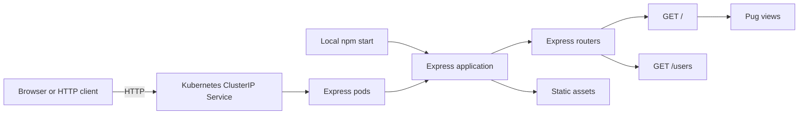

# My Vulnerable Express

A small Express application used to demonstrate CI/CD and application security tooling. It renders the default Express page, exposes a sample users endpoint, includes a deliberately unsafe code sample, and provides Docker and Kubernetes deployment files.

> [!WARNING]
> This repository is intentionally vulnerable and uses outdated dependencies. Do not deploy it to production or expose it to untrusted traffic.

## Architecture



When run locally, clients connect directly to the Express application. In Kubernetes, the ClusterIP Service distributes requests across three Express pods.

## Requirements

- Node.js and npm
- Docker (optional)
- Kubernetes and `kubectl` (optional)

The container currently uses Node.js 8 by default. That release is end-of-life and is retained only for compatibility with this demo.

## Run locally

Install dependencies and start the server:

```sh
npm install
npm start
```

The application listens on `http://localhost:3000` by default. Set `PORT` to use another port:

```sh
PORT=5000 npm start
```

## Routes

| Method | Path | Description |
| --- | --- | --- |
| `GET` | `/` | Renders the default Express welcome page. |
| `GET` | `/users` | Returns the sample users response. |

The file `routes/evalme.js` deliberately evaluates request input to support security-scanning demonstrations. It is imported by the application but is not currently mounted as a reachable route. Never mount or reuse this handler in a real application.

## Tests

Run the test suite:

```sh
npm test
```

Generate a JUnit report at `reports/junit.xml` for CI:

```sh
npm run test:ci
```

## Docker

Build and run the image:

```sh
docker build -t myvulnerableexpress .
docker run --rm -p 5000:5000 myvulnerableexpress
```

The Docker build accepts `NODE_IMAGE`, `NODE_ENV`, and `NPM_REGISTRY` build arguments. For example:

```sh
docker build \
	--build-arg NODE_IMAGE=node:8.11-alpine \
	--build-arg NODE_ENV=production \
	-t myvulnerableexpress .
```

## Kubernetes

The manifests in `k8s/` create a three-replica Deployment and an internal ClusterIP Service. Update the image in `k8s/deployment.yaml` to an image available to your cluster, then apply the manifests:

```sh
kubectl apply -f k8s/
kubectl port-forward service/myvulnerableexpress 8080:80
```

Open `http://localhost:8080` while the port-forward is running.

Validate the manifests without changing a cluster:

```sh
kubectl apply --dry-run=client -f k8s/
```

## Project structure

| Path | Purpose |
| --- | --- |
| `app.js` | Configures Express middleware, routes, and error handling. |
| `bin/www` | Creates and starts the HTTP server. |
| `routes/` | Contains request handlers, including the unsafe demo sample. |
| `views/` | Contains Pug templates. |
| `public/` | Contains static assets. |
| `test/` | Contains the Mocha and Supertest test suite. |
| `k8s/` | Contains Kubernetes Deployment and Service manifests. |
